# GottaMinute Fitness User Guide

Welcome to **GottaMinute Fitness**. This guide walks you through every feature in the app, how to use each one, and how the pieces fit together..

---

## Table of Contents

1. [Quick Tour](#1-quick-tour)
2. [Creating Your Account](#2-creating-your-account)
3. [Profile and Avatar](#3-profile-and-avatar)
4. [Home Dashboard](#4-home-dashboard)
5. [Body Scan](#5-body-scan)
6. [Workout Plan](#6-workout-plan)
7. [Workout Runner](#7-workout-runner)
8. [Exercise Library](#8-exercise-library)
9. [Water Tracking](#9-water-tracking)
10. [Daily Tracking Tiles](#10-daily-tracking-tiles)
11. [Health App Connection](#11-health-app-connection)
12. [Account and Settings](#12-account-and-settings)
13. [External Services](#13-external-services)
14. [A Typical Day](#14-a-typical-day)

---

## 1. Quick Tour

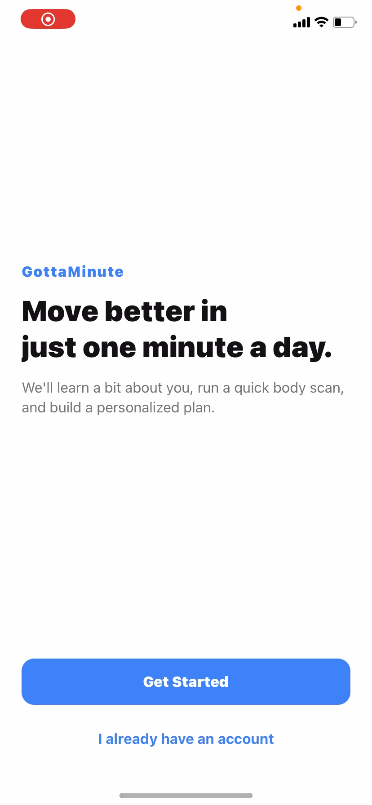

Once you sign in, you move between the app from four tabs at the bottom:

| Tab | What You Do Here |
|---|---|
| Home | Dashboard with today's workout, progress ring, water, streak, and tracking tiles |
| Scan | Take three body photos to get a body-composition analysis |
| Plan | See, generate, or edit your weekly workout plan |
| Account | Profile, profile picture, Health-app connection, settings, and logout |

---

## 2. Creating Your Account

### 2.1 Signing Up

1. Open the app. First-time users land on the welcome screen.
2. Tap **Create account** and enter your email, a username, and a password + confirmed password.

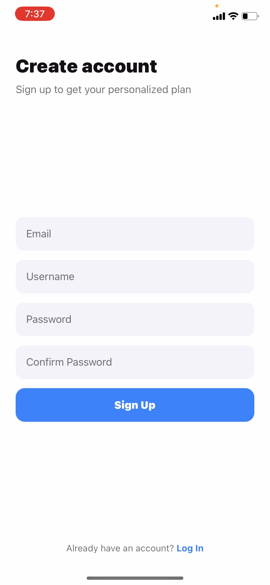

3. Fill in the short profile form: first and last name, height (feet + inches), weight (lbs), age, and gender.

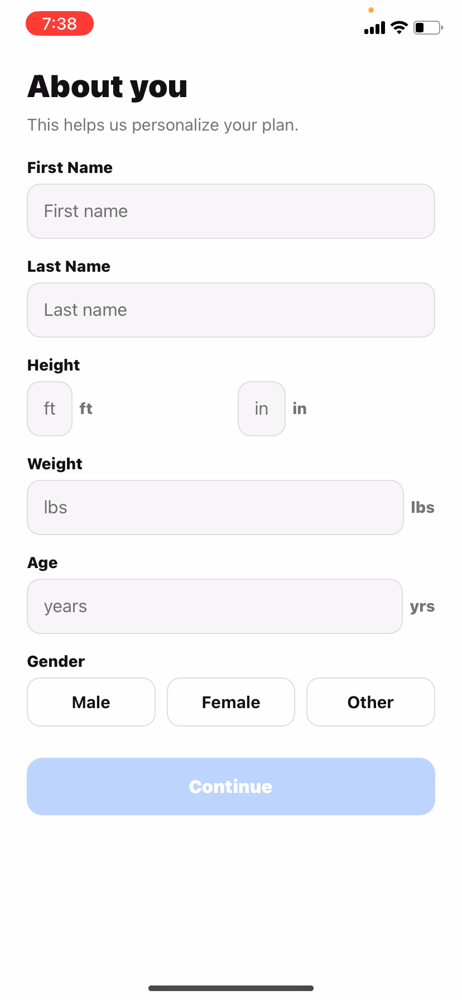

4. You are signed in automatically after account creation.

### 2.2 Logging In Again

Returning users tap **Log in** on the welcome screen and enter their username and password. The app keeps you signed in between launches. Sign out from **Account → Log out**.

---

## 3. Profile and Avatar

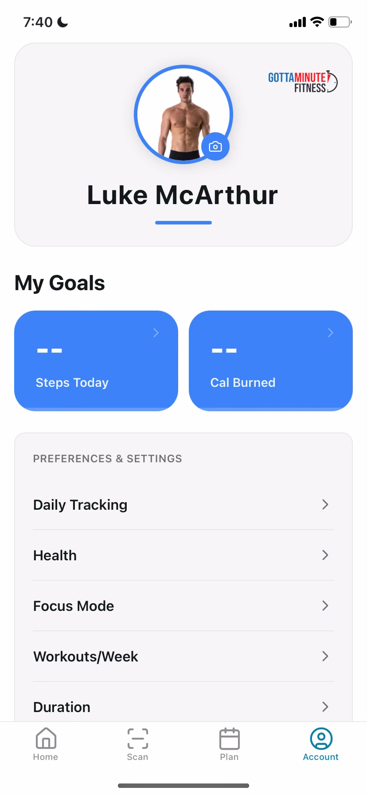

### 3.1 Updating Your Profile

From the **Account** tab, tap **Profile Info** to change your name, age, weight, height, gender, or fitness goal.

### 3.2 Changing Your Avatar

Tap your avatar at the top of the **Account** tab to pick a new photo from your camera or library.

| Supported format | Max size |
|---|---|
| JPG, PNG, HEIC | 5 MB |

### 3.3 Results You Will See

- Your avatar appears on the Account screen and throughout the app.
- Updating your **weight** immediately updates the daily water goal.
- Updating your **fitness goal** changes the advice the AI gives you in scan insights and workout plans.

---

## 4. Home Dashboard

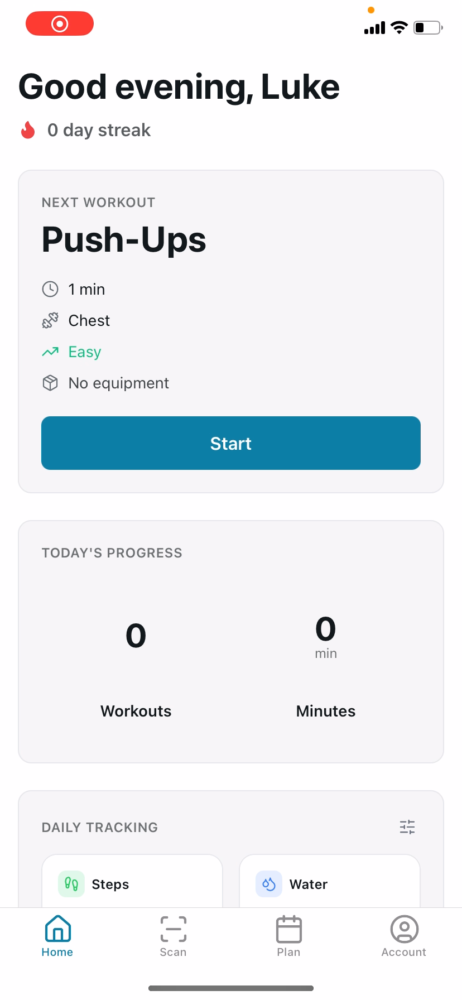

The Home tab is the first screen after login. It is built to show the user the immediate information they need.

### 4.1 What You See

- **Greeting + streak**: your name and how many days in a row you have trained.
- **Next Workout card**: the next exercise due today. Tap **Start** to jump into it.
- **Today's Progress**: how many workouts you have completed today versus your daily goal.
- **Daily Tracking tiles**: configurable stats such as Steps, Water, Calories, and Sleep.
- **Quick Picks**: shortcut chips that jump to the Plan tab.
- **Recent Workouts**: your last three completed sessions.

### 4.2 How It Connects to the Rest of the App

- The **Next Workout** card pulls from your weekly plan. Without a plan, it prompts you to do a body scan first.
- Completing a workout updates the progress ring, the streak, and the Recent Workouts strip the next time Home loads.
- Tapping the **Water** tile opens the water logger (see [§9](#9-water-tracking)).

---

## 5. Body Scan

Use the **Scan** tab to analyze your body composition from three photos.

### 5.1 Taking a Scan

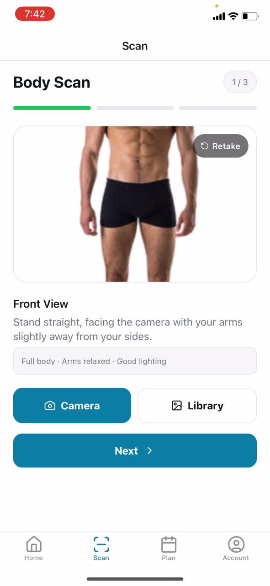

1. Open the **Scan** tab. The flow walks you through three steps: **Front**, **Side**, **Back**.
2. For each step, tap **Camera** to take a photo or **Library** to pick an existing one.
3. A progress bar at the top shows which photos are captured. You can retake any photo before moving on.
4. After the third photo, tap **Analyze Scan**. Analysis takes a few seconds.

> **Tip:** use consistent lighting, a plain background, fitted clothing, and stand with arms slightly away from your body for the best results.

### 5.2 What You Get Back

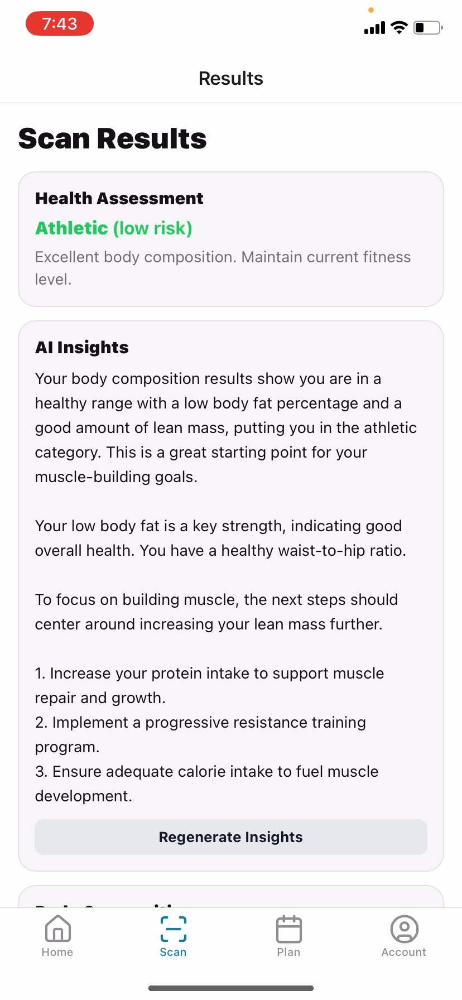

- **Body measurements** (inches): neck, shoulders, waist, hip, thigh, knee, calf, ankle.
- **Body composition**: BMI, body-fat percentage, fat mass, lean mass, waist-to-hip ratio.
- **Health category**: Athletic, Fit, Acceptable, or Obese, each with a short recommendation.
- **AI insights**: a plain-language summary with two or three tailored next-step suggestions.

### 5.3 How Scans Connect to Other Features

- Your most recent scan feeds into workout plan generation so the AI knows your current body-fat percentage.
- If the AI insights look stale, open an old scan and tap **Regenerate Insights**.
- The scan flow is the recommended way to get your first workout plan.

---

## 6. Workout Plan

You always have exactly **one workout plan** at a time, and you can regenerate it whenever you want.

### 6.1 Generating a Plan

1. Open the **Plan** tab. If you have no plan, the generator form opens automatically. Otherwise, tap **Regenerate**.
2. Pick **days per week** (3 to 7) and **minutes per session** (15 to 60).
3. Check the equipment you have: Bodyweight, Dumbbell, Barbell, Machine, or Band.
4. Optionally list exercises to avoid and a goal override (e.g. "build endurance").
5. Tap **Generate**. The AI builds a plan tuned to your profile, your latest scan, and your equipment.

### 6.2 Viewing the Plan

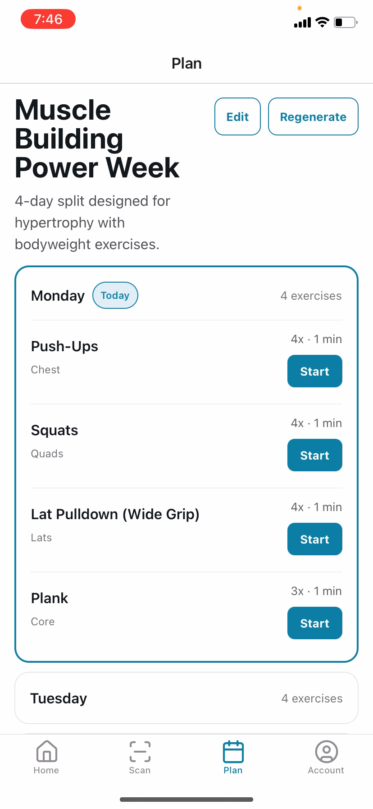

- The Plan tab shows all seven days as collapsible cards.
- **Today** is highlighted and expanded by default.
- Days without exercises show a **Rest** badge.
- Each exercise displays its muscle group, reps-per-day, and duration.

### 6.3 Editing the Plan

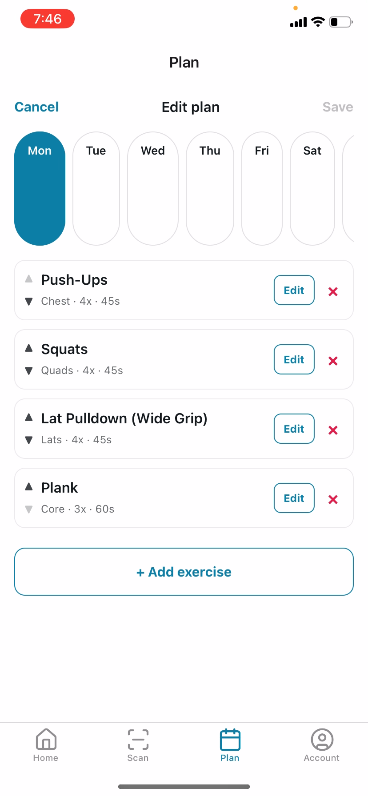

1. Tap **Edit** on the Plan tab.
2. Pick a day from the row of day tabs.
3. For each exercise you can:
   - Tap the **▲/▼** arrows to reorder.
   - Tap **Edit** to change the times-per-day and duration.
   - Tap **×** to remove it.
4. Tap **+ Add exercise** to search the full library and add a new one.
5. Tap **Save**, or **Cancel** to discard your changes.

> **Note:** generating a new plan replaces the old one, but your workout history is always kept.

---

## 7. Workout Runner

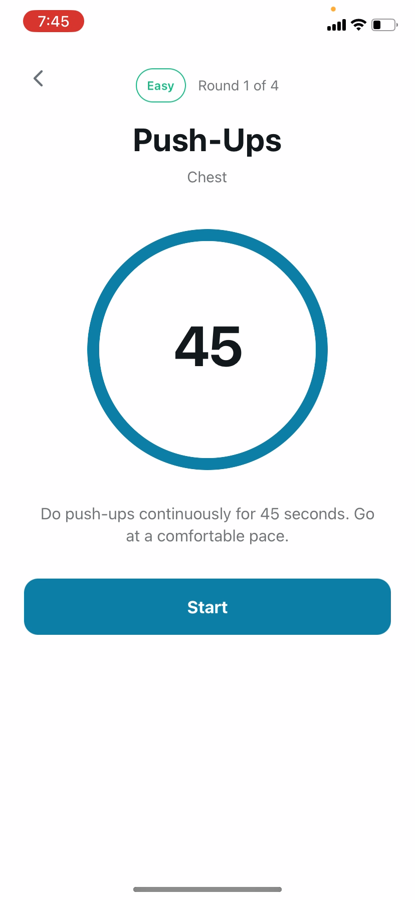

The runner is the screen that actually runs a workout.

### 7.1 Using the Timer

1. Tap **Start** on the Home card or next to any of today's exercises in the Plan tab.
2. A circular countdown timer appears, sized to that exercise's duration.
3. Tap **Start** again to begin. The ring shrinks as time passes.
4. When time's up, the screen shows a checkmark and logs the completion automatically.

### 7.2 What Happens After You Finish

- The completion is saved to your history.
- Your streak updates if this was your first workout of the day.
- The **Next Workout** card moves on to the next exercise in today's plan.
- Once all of today's exercises are done, Home shows an **"All Done!"** card.

---

## 8. Exercise Library

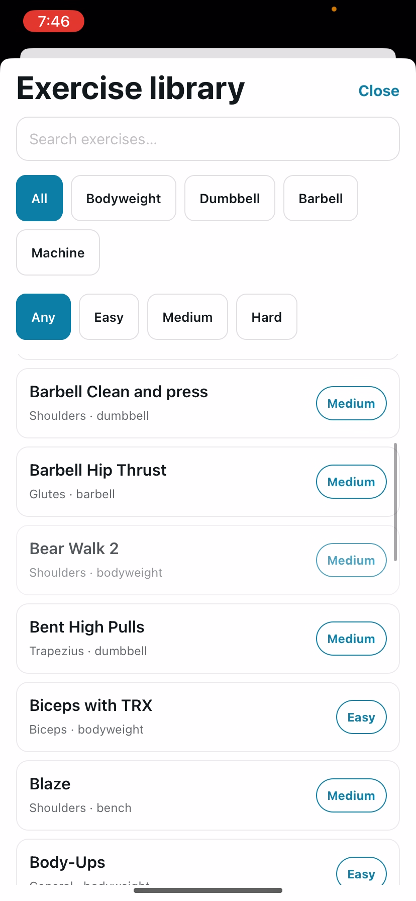

The library is the catalog of exercises the Plan editor and the AI generator draw from. It appears as a search sheet whenever you tap **+ Add exercise** in the Plan editor.

### 8.1 Searching

- Type part of the name (e.g. "squat").
- Filter by muscle group, equipment, category (strength / cardio / core), or difficulty.

---

## 9. Water Tracking

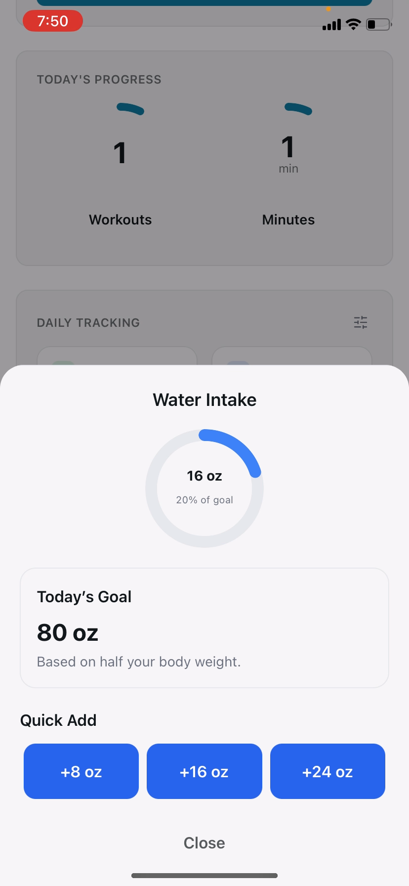

### 9.1 Logging Water

1. From Home, tap the **Water** tile.
2. Add a preset amount (8 oz / 16 oz / etc.) or type a custom value.

### 9.2 Your Daily Goal

| Condition | Goal |
|---|---|
| Weight saved in profile | Roughly half your weight in fluid ounces |
| No weight saved | 64 oz (default) |

> **Note:** the Water tile's ring fills as you log through the day and resets at midnight.

---

## 10. Daily Tracking Tiles

The Home screen shows a grid of tiles. You choose which ones appear.

### 10.1 Customizing Your Tiles

- Tap the **gear** icon on the Daily Tracking section on Home, **or** go to **Account → Daily Tracking**.
- Turn any of these on or off (up to the app's maximum):

| Tile | Source |
|---|---|
| Water | Water logger (see [§9](#9-water-tracking)) |
| Steps | Phone health app |
| Calories | Phone health app |
| Exercise Minutes | Phone health app |
| Distance | Phone health app |
| Floors | Phone health app |
| Resting Heart Rate | Phone health app |
| Sleep | Phone health app |

- Tap **Save**.

### 10.2 Adaptive Step Goal

Your step goal is **adaptive**. The app looks at your last seven days and sets a realistic target.

> **Tip:** if Health access is not granted, tiles show `--` and a **Connect Health** button appears. Tapping it opens the permission screen described in [§11](#11-health-app-connection).

---

## 11. Health App Connection

### 11.1 Connecting

1. Go to **Account → Health**.
2. Tap the toggle to request access. Your phone shows the standard Apple Health or Health Connect permission sheet.
3. Grant the permissions you are comfortable with.

### 11.2 What Gets Read

The app reads (but never writes) the following categories:

- Step count
- Active energy burned (calories)
- Exercise minutes
- Distance walked or run
- Flights climbed
- Resting heart rate
- Sleep analysis

> **Important:** health data stays on your phone. GottaMinute Fitness does not upload it to the backend. It is displayed locally only.

---

## 12. Account and Settings

The **Account** tab is the hub for everything personal:

- **Avatar**: tap to change
- **Goal cards**: quick read-outs of today's steps and calories from your health app
- **Preferences & Settings**:
  - Daily Tracking: pick which tiles show on Home ([§10](#10-daily-tracking-tiles))
  - Health: connect Apple Health / Health Connect ([§11](#11-health-app-connection))
  - Profile Info: edit your name, age, weight, height, gender, fitness goal
  - Log out

> **Note:** a few items in the settings list (Focus Mode, Workouts/Week, Duration, Exercise Variability, Payment Method, My Gear, Subscription) are placeholders for future releases.

---

## 13. External Services

You do not need to "turn these on". They work behind the scenes. Here is what each one does so you know where your results come from.

| Service | What It Does for You |
|---|---|
| Apple Health / Health Connect | Provides the numbers behind the Daily Tracking tiles (steps, calories, sleep, etc.) |
| Google Gemini (AI) | Writes the plain-language insights on your scan results and generates your personalized workout plans |
| MediaPipe (pose detection) | Measures your body from the three scan photos so the app can estimate circumferences and body-fat percentage |

> **Note:** if the AI service is ever unavailable, scans still work. You see the measurements and health category, just without the AI summary paragraph.

---

## 14. A Typical Day

1. Open the app. Home shows today's Next Workout, progress ring, and your tiles.
2. Tap **Start** on the Next Workout card.
3. Run the countdown timer. Home refreshes with your new progress and streak.
4. Tap the **Water** tile a few times during the day to log intake.
5. Do a **Body Scan** every couple of weeks to see body-composition trends.
6. Regenerate your **Plan** whenever your goals or equipment change.
